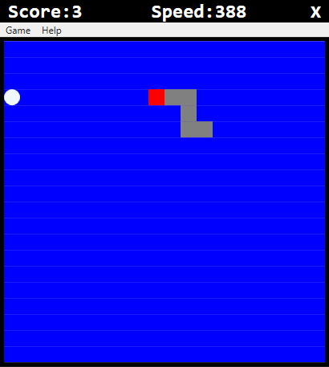

# WPF Snake Game

It is a simple snake game develop using wpf. The snake eats randomly
generated and it's size increases as it eats. The player's score as long as the snake 
continues to eat the generated food. 

## Technologies 

- C# 
- .Net 
- WPF
- Xaml
- Visual Studio

## Game Controls

- Up Arrow: Moves snake up
- Down Arrow: Moves snake Down
- Left Arrow: Moves snake to the left
- Right Arrow: Moves snake to the right

## Keyboard Shortcuts

- Ctrl + G: Plays Game 
- Ctrl + P: Pauses Game
- Alt + C: Continues Game
- Ctrl + R - Resets Game
- Ctrl + Q - Quits Game 

## Game Menubar items

- Play Game
- Pause
- Continue
- Reset
- Quit 

## Gameplay

